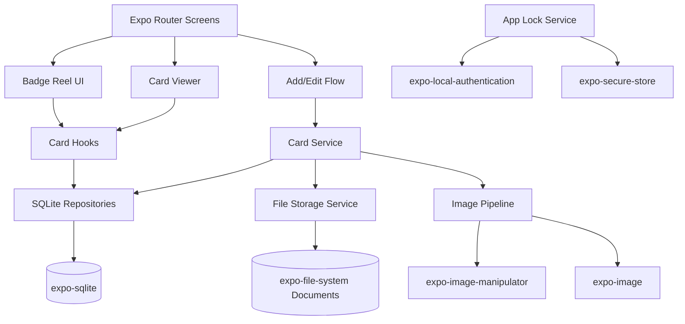

# BadgeDeck / Badge Reel Tech Spec

## 1. Product goal

Build an offline-first Expo app for healthcare professionals to store, organize, and rapidly view digital copies of badge reference cards. The defining feature is a **fluid 3D badge reel** interface that feels like scrolling through physical laminated cards on a badge holder.

Primary success criteria:

- Users can add a front/back reference card from camera or photo library.
- Cards are stored locally and available offline.
- The home screen renders a smooth animated badge-card reel.
- Users can open a card instantly into a zoomable full-screen viewer.
- App supports app lock with biometric/device authentication.
- MVP avoids cloud sync and avoids storing PHI by design.

---

## 2. Technical baseline

Target Expo SDK: **56**

Relevant SDK 56 docs checked:

- `expo-router`: bundled `~56.2.7`
- `react-native-reanimated`: bundled `4.3.1`
- `react-native-gesture-handler`: bundled `~2.31.1`
- `expo-sqlite`: bundled `~56.0.4`
- `expo-file-system`: bundled `~56.0.7`
- `expo-image`: bundled `~56.0.9`
- `expo-image-picker`: bundled `~56.0.14`
- `expo-image-manipulator`: bundled `~56.0.15`
- `expo-haptics`: bundled `~56.0.3`
- `expo-secure-store`: bundled `~56.0.4`
- `expo-local-authentication`: bundled `~56.0.4`
- `expo-document-picker`: bundled `~56.0.4`
- `expo-gl`: bundled `~56.0.5`, optional/future

SDK 56 platform baseline:

- React Native `0.85`
- React `19.2.3`
- Node.js `22.13.x`
- Android `7+`
- iOS `16.4+`

Recommended install set:

```sh
npx expo install expo-router react-native-reanimated react-native-worklets react-native-gesture-handler expo-sqlite expo-file-system expo-image expo-image-picker expo-image-manipulator expo-haptics expo-secure-store expo-local-authentication expo-document-picker
```

Do **not** start with `expo-gl`; keep it as a fallback if Reanimated fake-3D cannot achieve the desired effect.

---

## 3. High-level architecture



### Architecture principles

- **Offline-first.**
- **Local-only for MVP.**
- **SQLite for metadata, files for images.**
- **Animations stay on UI thread using Reanimated.**
- **Use thumbnails in the reel, full-size images only in viewer.**
- **No PHI/cloud sync in MVP.**
- **Expo Router only; avoid importing from external `@react-navigation/*` packages in app code because SDK 56 Expo Router expects matching `expo-router` entry points.**

---

## 4. Project structure

Recommended structure:

```text
app/
  _layout.tsx
  index.tsx

  (onboarding)/
    _layout.tsx
    welcome.tsx
    privacy.tsx
    first-card.tsx

  (auth)/
    unlock.tsx

  (app)/
    _layout.tsx
    index.tsx                  # reel home
    search.tsx                 # modal/search route
    settings.tsx

    card/
      [id].tsx                 # full-screen viewer
      [id]/
        edit.tsx

    add/
      index.tsx                # source picker
      capture.tsx
      crop.tsx
      metadata.tsx

src/
  db/
    database.ts
    migrations.ts
    schema.ts
    repositories/
      cardsRepository.ts
      categoriesRepository.ts
      tagsRepository.ts
      settingsRepository.ts

  storage/
    cardFileStore.ts
    imagePipeline.ts
    fileNaming.ts

  features/
    cards/
      types.ts
      useCards.ts
      useCard.ts
      cardService.ts

    reel/
      BadgeReel.tsx
      BadgeReelCard.tsx
      ReelClip.tsx
      reelMath.ts
      useBadgeReelController.ts

    viewer/
      CardViewer.tsx
      ZoomableImage.tsx
      FrontBackToggle.tsx

    add-card/
      AddCardSourceScreen.tsx
      CaptureCardScreen.tsx
      CropCardScreen.tsx
      CardMetadataScreen.tsx

    settings/
      SettingsScreen.tsx
      AppLockSettings.tsx

    security/
      appLockService.ts
      useAppLock.ts

  ui/
    components/
      Button.tsx
      IconButton.tsx
      Sheet.tsx
      EmptyState.tsx
      SearchField.tsx
    theme/
      colors.ts
      spacing.ts
      typography.ts

  utils/
    ids.ts
    dates.ts
    errors.ts
```

---

## 5. Routing spec

Use Expo Router file-based routes.

### Root behavior

`app/_layout.tsx`

Responsibilities:

- Load fonts/theme.
- Initialize SQLite provider or database bootstrapping.
- Initialize app lock listener.
- Render root stack.
- Hide splash only after database/settings are ready.

### Initial route decision

On launch:

1. Check whether onboarding has completed.
2. If not, route to `(onboarding)/welcome`.
3. If app lock is enabled and auth is required, route to `(auth)/unlock`.
4. Otherwise route to `(app)/index`.

### Main routes

| Route | Purpose |
|---|---|
| `(app)/index` | 3D badge reel home |
| `(app)/search` | Search overlay/modal |
| `(app)/card/[id]` | Full-screen card viewer |
| `(app)/card/[id]/edit` | Edit title/category/tags/assets |
| `(app)/add/index` | Choose camera/photo/document |
| `(app)/add/capture` | Camera or selected image preview |
| `(app)/add/crop` | Crop/resize flow |
| `(app)/add/metadata` | Add title/category/tags |
| `(app)/settings` | App settings/security/storage |

---

## 6. Data model

Use `expo-sqlite`. Enable WAL mode during initialization. Use `PRAGMA user_version` migrations.

### Tables

#### `cards`

```sql
CREATE TABLE cards (
  id TEXT PRIMARY KEY NOT NULL,
  title TEXT NOT NULL,
  subtitle TEXT,
  category_id TEXT,
  primary_color TEXT,
  sort_order INTEGER NOT NULL DEFAULT 0,
  is_favorite INTEGER NOT NULL DEFAULT 0,
  is_archived INTEGER NOT NULL DEFAULT 0,
  review_date TEXT,
  source_type TEXT NOT NULL DEFAULT 'user_image',
  notes TEXT,
  created_at TEXT NOT NULL,
  updated_at TEXT NOT NULL,
  last_viewed_at TEXT,
  FOREIGN KEY (category_id) REFERENCES categories(id)
);
```

#### `card_assets`

```sql
CREATE TABLE card_assets (
  id TEXT PRIMARY KEY NOT NULL,
  card_id TEXT NOT NULL,
  side TEXT NOT NULL, -- front, back, extra_1...
  file_uri TEXT NOT NULL,
  thumbnail_uri TEXT NOT NULL,
  display_uri TEXT,
  mime_type TEXT NOT NULL,
  width INTEGER NOT NULL,
  height INTEGER NOT NULL,
  thumbnail_width INTEGER NOT NULL,
  thumbnail_height INTEGER NOT NULL,
  file_size INTEGER,
  thumbhash TEXT,
  ocr_text TEXT,
  crop_data_json TEXT,
  created_at TEXT NOT NULL,
  updated_at TEXT NOT NULL,
  FOREIGN KEY (card_id) REFERENCES cards(id) ON DELETE CASCADE
);
```

#### `categories`

```sql
CREATE TABLE categories (
  id TEXT PRIMARY KEY NOT NULL,
  name TEXT NOT NULL UNIQUE,
  color TEXT,
  icon TEXT,
  sort_order INTEGER NOT NULL DEFAULT 0,
  created_at TEXT NOT NULL,
  updated_at TEXT NOT NULL
);
```

#### `tags`

```sql
CREATE TABLE tags (
  id TEXT PRIMARY KEY NOT NULL,
  name TEXT NOT NULL UNIQUE,
  created_at TEXT NOT NULL
);
```

#### `card_tags`

```sql
CREATE TABLE card_tags (
  card_id TEXT NOT NULL,
  tag_id TEXT NOT NULL,
  PRIMARY KEY (card_id, tag_id),
  FOREIGN KEY (card_id) REFERENCES cards(id) ON DELETE CASCADE,
  FOREIGN KEY (tag_id) REFERENCES tags(id) ON DELETE CASCADE
);
```

#### `settings`

```sql
CREATE TABLE settings (
  key TEXT PRIMARY KEY NOT NULL,
  value TEXT NOT NULL,
  updated_at TEXT NOT NULL
);
```

### Optional search table

For MVP, search can use basic `LIKE` queries over `title`, `subtitle`, `notes`, category, and tags.

Later, add FTS:

```sql
CREATE VIRTUAL TABLE card_search USING fts5(
  card_id UNINDEXED,
  title,
  subtitle,
  notes,
  tags,
  category,
  ocr_text
);
```

Expo SQLite SDK 56 supports FTS via config; FTS is enabled by default unless disabled in plugin config.

### Indexes

```sql
CREATE INDEX idx_cards_category ON cards(category_id);
CREATE INDEX idx_cards_favorite ON cards(is_favorite);
CREATE INDEX idx_cards_archived ON cards(is_archived);
CREATE INDEX idx_cards_sort_order ON cards(sort_order);
CREATE INDEX idx_card_assets_card_id ON card_assets(card_id);
CREATE INDEX idx_card_assets_side ON card_assets(card_id, side);
CREATE INDEX idx_card_tags_tag_id ON card_tags(tag_id);
```

---

## 7. Local file storage

Use SDK 56 `expo-file-system` object API:

```ts
import { Directory, File, Paths } from 'expo-file-system';
```

Avoid deprecated legacy methods unless explicitly importing from `expo-file-system/legacy`.

### Storage root

Use `Paths.document`, not cache, because card files are user data.

Recommended layout:

```text
document/
  cards/
    {cardId}/
      front-original.jpg
      front-display.jpg
      front-thumb.jpg
      back-original.jpg
      back-display.jpg
      back-thumb.jpg
```

### File roles

| File | Purpose |
|---|---|
| `*-original` | Original or highest-quality saved source |
| `*-display` | Optimized detail-view image |
| `*-thumb` | Small reel thumbnail |

### Image sizing targets

| Asset | Long edge | Format | Quality |
|---|---:|---|---:|
| Original | source or capped | JPEG/PNG | source/copy |
| Display | `1800–2200px` | JPEG | `0.85–0.92` |
| Thumbnail | `400–700px` | JPEG | `0.7–0.82` |

For clinical readability, favor clarity over tiny file size.

---

## 8. Image import pipeline

### Source options

MVP:

- `expo-image-picker` camera
- `expo-image-picker` photo library

Near-future:

- `expo-document-picker` for images/PDFs

### Capture/import sequence

1. User chooses source.
2. Request permission if needed.
3. Launch camera or image library.
4. On Android, handle `ImagePicker.getPendingResultAsync()` on app recovery.
5. Store selected image in a temporary import state.
6. User crops/rotates if necessary.
7. Run image pipeline:
   - crop
   - rotate if needed
   - resize display version
   - resize thumbnail
   - save to cache via `ImageManipulator`
   - move/copy final files to `Paths.document/cards/{cardId}`
8. Create database rows inside a SQLite transaction.
9. Navigate to new card in reel.

### Image manipulation

Use SDK 56 `expo-image-manipulator` contextual API:

- `ImageManipulator.manipulate(source)`
- chain `crop`, `resize`, `rotate`, `flip`
- `renderAsync`
- `saveAsync`

The older `manipulateAsync` API is deprecated in SDK 56 docs.

### Placeholders

Use `expo-image` for rendering and caching.

Possible placeholder strategy:

- generate `thumbhash` using `expo-image` `generateThumbhashAsync`
- store in `card_assets.thumbhash`
- pass as image placeholder in reel/viewer

---

## 9. Card repository API

Create repositories that hide SQL from UI.

### `CardsRepository`

Required methods:

```ts
listCards(params)
getCardById(id)
createCard(input)
updateCard(id, patch)
archiveCard(id)
deleteCard(id)
toggleFavorite(id)
reorderCards(cardIds)
markViewed(id)
searchCards(query, filters)
```

### `CardAssetsRepository`

```ts
listAssetsForCard(cardId)
getPrimaryAsset(cardId)
upsertAsset(input)
deleteAsset(assetId)
```

### `CategoriesRepository`

```ts
listCategories()
createCategory(input)
updateCategory(id, patch)
deleteCategory(id)
```

### `TagsRepository`

```ts
listTags()
setTagsForCard(cardId, tagNames)
```

### Transaction boundaries

Use transactions for:

- creating a card + assets + tags
- deleting a card + removing file folder
- reordering multiple cards
- import pipeline finalization

For SQLite SDK 56, prefer `withExclusiveTransactionAsync` when the write must not be interrupted by unrelated async writes.

---

## 10. State management

Keep MVP simple.

Recommended:

- SQLite repositories for persistent data.
- Feature hooks for loading data.
- React state for screen-local UI.
- Context for:
  - theme/settings
  - app lock status
  - current reel filter
- Avoid global normalized stores until sync/cloud features exist.

Suggested hooks:

```ts
useCards(filters)
useCard(cardId)
useCategories()
useCardSearch(query)
useAppSettings()
useAppLock()
```

If later adding sync or remote decks, introduce TanStack Query or a sync-specific cache then.

---

## 11. 3D badge reel spec

### Goal

Create a signature interaction that resembles a physical reel/stack of badge cards.

### Implementation choice

Use Reanimated + Gesture Handler fake 3D.

Avoid `expo-gl` initially.

### Reel behavior

- Vertical scroll by default.
- Center card is focused.
- Cards above/below angle away in 3D.
- Snap to nearest card.
- Selection haptic when active card changes.
- Tap focused card opens viewer.
- Long press opens quick actions.
- Double tap toggles favorite.
- Reduced motion setting switches to flat list/stack.

### Component API

```ts
type BadgeReelProps = {
  cards: CardSummary[];
  initialCardId?: string;
  onCardPress: (cardId: string) => void;
  onFavoriteToggle: (cardId: string) => void;
  reduceMotion: boolean;
};
```

### Card summary type

```ts
type CardSummary = {
  id: string;
  title: string;
  categoryName?: string;
  categoryColor?: string;
  isFavorite: boolean;
  frontThumbnailUri: string;
  thumbhash?: string;
  aspectRatio: number;
};
```

### Animation model

Maintain a Reanimated shared value:

```text
progress = scrollOffset / itemSpacing
distance = cardIndex - progress
```

For each visible card:

```text
absD = abs(distance)

translateY:
  distance * itemSpacing

scale:
  absD 0 -> 1.00
  absD 1 -> 0.91
  absD 2 -> 0.84
  absD 3 -> 0.76

rotateX:
  distance -3 -> 48deg
  distance -1 -> 18deg
  distance  0 -> 0deg
  distance  1 -> -18deg
  distance  3 -> -48deg

opacity:
  absD 0 -> 1.00
  absD 1 -> 0.85
  absD 2 -> 0.55
  absD 3 -> 0.20

zIndex:
  higher when absD is lower
```

Use transform with:

```text
perspective: 900–1200
rotateX
translateY
scale
```

### Visible window

Render only nearby cards:

```text
active index ± 3
```

A 7-card window should be enough for the effect and helps performance.

### Haptics

Use `expo-haptics`.

- Snap/selection: `Haptics.selectionAsync()`
- Add success: `notificationAsync(Success)`
- Delete/error: `notificationAsync(Error)`
- Android-specific future: `performAndroidHapticsAsync(AndroidHaptics.Segment_Tick)`

Throttle haptics so fast flicks do not spam feedback.

### Performance rules

- Reel uses thumbnails only.
- No full-resolution images in reel.
- No expensive React state updates during gesture.
- Animation derived from shared values.
- Use memoized card components.
- Avoid blur during scroll unless performance is proven.
- Use `expo-image` `recyclingKey` for recycled card views.
- Prefetch active card ± 2 thumbnails.

---

## 12. Card viewer spec

### Route

```text
(app)/card/[id]
```

### Features

- Full-screen viewer.
- Front/back toggle.
- Pinch to zoom.
- Pan while zoomed.
- Double tap to zoom in/out.
- Single tap hides controls.
- Favorite toggle.
- Edit button.
- Delete/archive menu.
- High-contrast background toggle.
- Shows title/category/tags when controls visible.

### Gesture implementation

Use Gesture Handler + Reanimated:

- `Pinch` for scale.
- `Pan` for translation.
- `Tap` for show/hide controls.
- `DoubleTap` for zoom.
- Clamp pan bounds based on image size and scale.
- Reset transform when switching front/back.

### Image loading

Use `expo-image`.

Viewer should load:

1. display image first
2. fallback to original if display image missing
3. thumbnail/thumbhash placeholder while loading

---

## 13. Add/edit card flow

### Add card route sequence

```text
/add/index -> /add/crop -> /add/metadata -> /(app)/card/[id]
```

### `/add/index`

Actions:

- Take photo
- Choose from photos
- Import document, optional/future
- Add sample card, optional

### Camera/photo picker

Use `expo-image-picker`.

Configuration:

- `mediaTypes: ['images']`
- `quality: 1`
- `allowsEditing: false` initially; custom crop flow gives more control
- request permissions before launching camera/photo library

### Document picker

Use `expo-document-picker` later for PDFs/images.

Important SDK 56 note:

- Use `copyToCacheDirectory: true` when the app needs immediate `expo-file-system` access after picking.

### Crop screen

MVP can use simple crop presets:

- Auto-fit
- Landscape card
- Portrait card
- Free crop
- Rotate 90 degrees

Later add edge detection/document scanner.

### Metadata screen

Fields:

- Title, required
- Category, optional
- Tags, optional
- Favorite toggle
- Add back side option

### Edit card

Allow:

- title/category/tags
- replace front/back
- add/remove back side
- archive/delete

---

## 14. Security and privacy

### MVP stance

- Local-only.
- No account.
- No cloud sync.
- No analytics containing card content.
- Explicit onboarding warning: do not capture PHI or patient identifiers.
- App is a personal reference tool, not medical advice.

### App lock

Use:

- `expo-local-authentication`
- `expo-secure-store`

Behavior:

- User enables app lock in settings.
- On foreground/resume, app checks lock timeout.
- If locked, route to `(auth)/unlock`.
- Unlock uses `LocalAuthentication.authenticateAsync`.
- Allow device passcode fallback unless user disables it.
- If authentication unavailable, show clear fallback message.

Important SDK 56 caveats:

- Face ID testing requires a development build; it is not supported in Expo Go.
- `SecureStore.requireAuthentication` has Expo Go limitations with biometrics.
- SecureStore is for small secrets/settings, not images or large JSON.

### SecureStore keys

```text
app_lock_enabled
app_lock_timeout_seconds
last_unlock_timestamp
```

If adding custom PIN later, store only a salted hash/derived verifier, not raw PIN.

### Encryption

MVP does not claim HIPAA compliance.

Future hardened mode:

- SQLCipher via `expo-sqlite` config plugin with `useSQLCipher: true`
- encrypted image files
- key material stored via SecureStore
- development/native build required because SQLCipher is not supported in Expo Go

---

## 15. App config plugins

Approximate `app.json` plugin needs:

```json
{
  "expo": {
    "plugins": [
      "expo-router",
      [
        "expo-sqlite",
        {
          "enableFTS": true,
          "useSQLCipher": false
        }
      ],
      [
        "expo-secure-store",
        {
          "configureAndroidBackup": true,
          "faceIDPermission": "Allow BadgeDeck to use Face ID to protect your reference cards."
        }
      ],
      [
        "expo-local-authentication",
        {
          "faceIDPermission": "Allow BadgeDeck to use Face ID to unlock your reference cards."
        }
      ],
      [
        "expo-image-picker",
        {
          "photosPermission": "Allow BadgeDeck to access photos so you can import reference cards.",
          "cameraPermission": "Allow BadgeDeck to use the camera so you can capture reference cards.",
          "microphonePermission": false
        }
      ],
      [
        "expo-file-system",
        {
          "supportsOpeningDocumentsInPlace": false,
          "enableFileSharing": false
        }
      ]
    ]
  }
}
```

Add `expo-document-picker` plugin later if enabling iCloud document import behavior.

---

## 16. Design system

### Visual direction

Dark, clinical, premium, fast.

Suggested palette:

```ts
background: '#07111F'
surface: '#101C2E'
surfaceElevated: '#17243A'
card: '#F8FAFC'
primary: '#2DD4BF'
secondary: '#60A5FA'
danger: '#F87171'
warning: '#FBBF24'
text: '#F8FAFC'
textMuted: '#94A3B8'
border: '#26364F'
```

### Typography

Use a clean medical/professional look:

- headings: semibold
- body: readable
- numeric/text-heavy cards should preserve original image clarity

### Components

Core UI components:

```text
Button
IconButton
FloatingActionButton
SearchField
Sheet
ConfirmDialog
EmptyState
CategoryPill
TagChip
SegmentedControl
```

### Accessibility

Required:

- reduced motion setting
- screen reader labels
- large touch targets
- dynamic text support where possible
- high contrast mode in viewer
- flat list fallback for reel
- no critical action hidden behind animation only

---

## 17. Settings spec

Settings screen sections:

### Library

- Sort order
- Default category
- Show archived cards
- Storage usage

### Security

- App lock on/off
- Require lock immediately / after 1 min / after 5 min / after 15 min
- Use biometrics/device passcode

### Appearance

- System/dark/light
- Reduce motion
- High contrast viewer
- Haptics on/off

### Data

- Export local backup, future
- Import backup, future
- Delete all cards

### About

- Disclaimer
- Privacy note
- Version
- Feedback/contact

---

## 18. Search and filtering

### MVP search scope

Search over:

- card title
- subtitle
- notes
- category name
- tags

### Filter options

- All cards
- Favorites
- Category
- Tag
- Recently viewed
- Archived

### Search UX

- Pull down or tap search icon from reel.
- Results appear as a flat list.
- Tapping result opens viewer.
- Long press result opens quick actions.

---

## 19. Error handling

Define typed errors:

```ts
PermissionDeniedError
ImageImportError
ImageProcessingError
FileStorageError
DatabaseError
AuthenticationError
CardNotFoundError
```

User-facing examples:

- “Camera permission is required to capture a card.”
- “Couldn’t process this image. Try choosing a smaller image or retaking the photo.”
- “This card file is missing. You can remove the card or replace the image.”
- “Authentication was canceled.”

Log internal diagnostics in dev only. Avoid logging image URIs/content in production analytics.

---

## 20. Testing plan

### Unit tests

- ID generation
- file naming
- schema migrations
- repository methods
- search query construction
- image pipeline input/output decisions
- app lock state transitions

### Integration tests

- create card with front only
- create card with front/back
- update metadata
- delete card removes DB rows and files
- reorder cards
- search cards
- app lock flow

### Manual device tests

At minimum:

- iPhone with Face ID
- iPhone simulator for non-biometric flows
- Android device with fingerprint
- Android emulator
- low-end Android if available

### Performance acceptance

Reel:

- no visible stutter with 50 cards
- no full-res images in reel
- smooth snapping
- haptic feedback not over-triggered

Viewer:

- opens selected card quickly
- pinch/pan smooth
- switching front/back does not flicker heavily

Import:

- large camera image successfully generates display and thumbnail assets
- Android picker pending result handled

---

## 21. MVP milestones

### Milestone 1: Motion prototype

Deliver:

- mocked card data
- vertical 3D reel
- snap behavior
- tap-to-open mock detail
- haptic selection
- reduced motion flat fallback

Acceptance:

- feels smooth on a physical device
- no database/files yet
- card reel visual direction approved

### Milestone 2: Local data foundation

Deliver:

- SQLite migrations
- repositories
- settings persistence
- local file storage service
- seeded sample cards optional

Acceptance:

- app can create/list/update/delete card records
- DB survives restart
- migrations are repeatable

### Milestone 3: Add card MVP

Deliver:

- image picker/camera import
- crop/rotate basic flow
- display/thumbnail generation
- front/back support
- metadata form
- save to DB/files

Acceptance:

- user can add a real card and see it in reel

### Milestone 4: Viewer MVP

Deliver:

- full-screen viewer
- front/back toggle
- pinch/pan/double-tap zoom
- favorite/edit/archive controls

Acceptance:

- user can reliably read and zoom cards

### Milestone 5: Security and polish

Deliver:

- app lock
- onboarding privacy notice
- settings
- search/filter
- empty states
- error states
- haptic setting
- reduced motion setting

Acceptance:

- MVP is TestFlight/internal-testing ready

---

## 22. Deferred features

Do not build in MVP unless the app is already stable:

- cloud sync
- user accounts
- team/shared decks
- built-in clinical content library
- OCR
- PDF page splitting
- AI card cleanup
- true OpenGL reel
- Watch app
- marketplace/community card packs
- HIPAA compliance claims

---

## 23. Open decisions

Before implementation, decide:

1. App name: `BadgeDeck`, `Badge Reel`, `ClinCards`, etc.
2. Horizontal vs vertical reel. Recommendation: **vertical**.
3. Whether to keep originals or only optimized images. Recommendation: keep originals for v1 unless storage pressure becomes a problem.
4. Whether back side is required or optional. Recommendation: optional.
5. Whether app lock is prompted on every launch or after timeout. Recommendation: configurable timeout.
6. Whether to include sample cards. Recommendation: yes, but clearly marked as non-clinical/demo unless medically reviewed.

---

## 24. Recommended first implementation task

Start with **Milestone 1: Motion prototype**.

Build:

```text
src/features/reel/
  BadgeReel.tsx
  BadgeReelCard.tsx
  ReelClip.tsx
  reelMath.ts
  mockCards.ts
```

Do not touch SQLite or file storage yet. The reel is the core product risk and should be proven first. Once the interaction feels excellent, wire it to real data.
